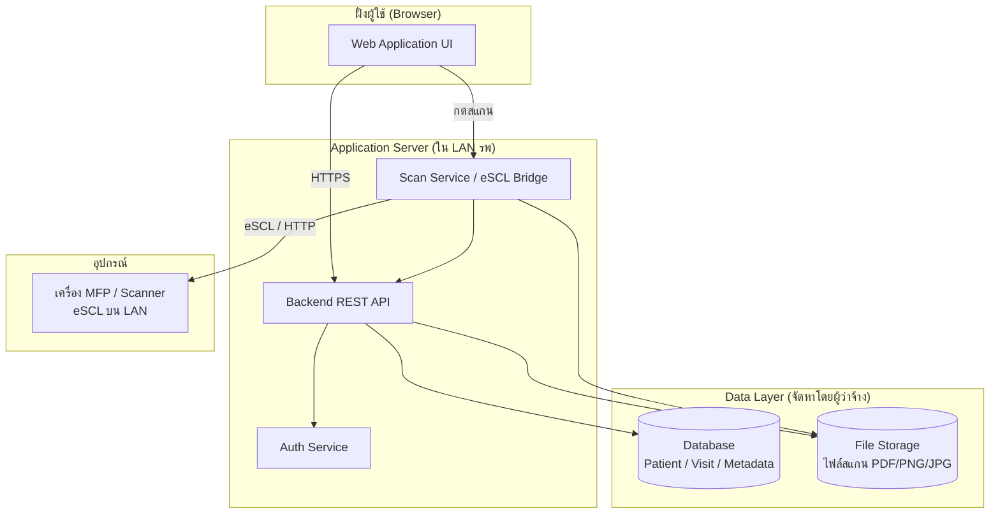
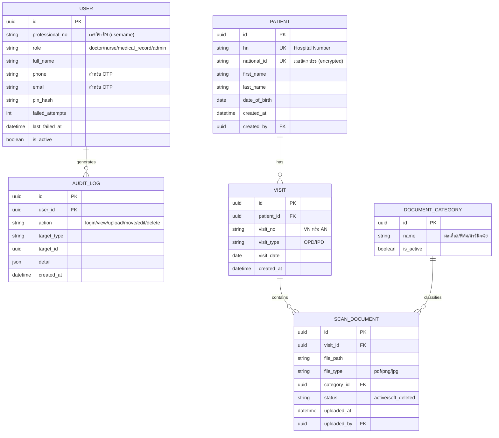

# 02 — Software Development Structure
## ระบบจัดเก็บและเรียกดูเอกสารสแกนผู้ป่วย (EMR Scan Viewer)

> เอกสารนี้อธิบายโครงสร้างเชิงเทคนิคของระบบ เพื่อใช้ออกแบบสถาปัตยกรรมและสร้าง Prototype
> *Tech stack ด้านล่างเป็นข้อเสนอแนะ (recommended) ปรับเปลี่ยนได้ตามทีมพัฒนา*

---

## 1. สถาปัตยกรรมระบบ (System Architecture)



### 1.1 องค์ประกอบหลัก
| องค์ประกอบ | หน้าที่ | ผู้รับผิดชอบ |
|-----------|--------|--------------|
| Web Application (Frontend) | UI สำหรับผู้ใช้ทุก role | ผู้รับจ้าง |
| Backend REST API | Business logic, จัดการข้อมูล, สิทธิ์ | ผู้รับจ้าง |
| Auth Service | Login, PIN, OTP, session | ผู้รับจ้าง |
| Scan Service (eSCL Bridge) | สั่งสแกน MFP และรับไฟล์ | ผู้รับจ้าง |
| Database | เก็บข้อมูล Patient/Visit/Metadata/Log | ผู้ว่าจ้าง (Infra) |
| File Storage | เก็บไฟล์เอกสารสแกน | ผู้ว่าจ้าง (Infra) |
| เครื่อง MFP/Scanner | สแกนเอกสาร | ผู้ว่าจ้าง |

> **ข้อสำคัญ:** Scan Service ต้องอยู่ในวง LAN เดียวกับเครื่อง MFP เนื่องจาก eSCL สื่อสารภายในเครือข่าย หากใช้ cloud server ภายนอกจะสั่งงานเครื่องไม่ได้ — กรณีนี้ต้องวาง Application Server (หรือ mini PC) ในวง รพ

---

## 2. Tech Stack ที่แนะนำ (Recommended)

| ส่วน | เทคโนโลยีที่แนะนำ | ทางเลือก |
|------|------------------|---------|
| Frontend | React / Next.js | Vue, Angular |
| Backend | Node.js (NestJS) หรือ Python (FastAPI) | Go, .NET |
| Database | PostgreSQL | MySQL / MariaDB |
| File Storage | Local NAS / MinIO (S3-compatible) | ตามที่ผู้ว่าจ้างจัดหา |
| Scan Service | Node/Python service เรียก eSCL ผ่าน HTTP | Dynamsoft Web TWAIN (กรณี Solution B) |
| Auth | JWT + bcrypt (hash PIN) | Session-based |
| OTP | บริการส่ง SMS/Email (เฟส reset) | — |
| OCR (เฟส 2) | Qwen-VL / Typhoon OCR (on-premise GPU) | — |

---

## 3. โมเดลข้อมูล (Data Model)



### 3.1 หลักการสำคัญของโมเดล
- **Patient เป็นแกนกลาง** — Visit และ Scan ห้อยใต้ตามลำดับ
- `national_id` และ `hn` เป็น unique key เพื่อกันสร้าง profile ซ้ำ
- `national_id` ต้อง **เข้ารหัสจัดเก็บ** (encrypted at rest)
- `pin_hash` เก็บเป็น hash เท่านั้น (ห้ามเก็บ PIN ตรง)
- การลบเอกสารใช้การเปลี่ยน `status` เป็น `soft_deleted` (ไม่ลบ record จริง)

---

## 4. โครงสร้างโมดูลซอฟต์แวร์ (Module / Component Structure)

```
emr-scan-viewer/
│
├── frontend/
│   ├── auth/                  # หน้า login, ตั้ง PIN, ลืม PIN (OTP)
│   ├── patient/               # ค้นหา/สร้าง/แก้ไข Patient Profile
│   ├── visit/                 # จัดการ Visit (VN/AN)
│   ├── scan-upload/           # สแกน eSCL + upload + เลือกหมวด + preview
│   ├── viewer/                # มุมมอง HN / Visit / รวมแยกหมวด + เปิดไฟล์
│   ├── document-management/   # ย้าย/แก้/ลบ (เวชระเบียน)
│   ├── audit-log/             # หน้าดู log (admin)
│   ├── settings/              # หมวดเอกสาร, session, scanner config
│   └── user-management/       # จัดการบัญชี (admin/เวชระเบียน)
│
├── backend/
│   ├── modules/
│   │   ├── auth/              # JWT, PIN hash, throttling, OTP
│   │   ├── user/              # CRUD user, role, reset PIN
│   │   ├── patient/           # CRUD + dedupe check
│   │   ├── visit/             # CRUD visit
│   │   ├── document/          # upload, move, soft-delete, category
│   │   ├── viewer/            # query เอกสารตาม HN/Visit/หมวด
│   │   ├── audit/             # บันทึก + query log
│   │   └── settings/          # config
│   ├── common/                # middleware, RBAC guard, encryption
│   └── scan-service/          # eSCL bridge (สั่งสแกน + รับไฟล์)
│
└── docs/                      # เอกสารชุดนี้
```

---

## 5. การควบคุมสิทธิ์ (RBAC Matrix)

| ฟังก์ชัน | แพทย์ | พยาบาล | เวชระเบียน | Admin |
|---------|:----:|:------:|:---------:|:-----:|
| ค้นหา/ดูเอกสาร | ✅ | ✅ | ✅ | ✅ |
| Print/Download | ✅ | ✅ | ✅ | ✅ |
| สร้าง Patient/Visit | — | ✅ | ✅ | ✅ |
| สแกน/อัปโหลดเอกสาร | — | ✅ | ✅ | ✅ |
| ย้าย/แก้/ลบเอกสาร (soft) | — | — | ✅ | ✅ |
| จัดการบัญชีผู้ใช้ | — | — | ✅ | ✅ |
| ดู Audit Log | — | — | — | ✅ |
| ตั้งค่าระบบ | — | — | — | ✅ |

> หมายเหตุ: สิทธิ์ Print/Download ปรับได้ตามนโยบาย รพ

---

## 6. การเชื่อมต่อสแกนเนอร์ (Scanner Integration)

### Solution A — Server-side eSCL (แนะนำ)
- Scan Service บน server สั่งเครื่อง MFP ผ่าน eSCL (HTTP) โดยตรง
- ไม่ต้องติดตั้งซอฟต์แวร์ที่เครื่องผู้ใช้
- ไม่มีค่า license (eSCL เป็นโปรโตคอลเปิด)
- **เงื่อนไข:** server อยู่ LAN เดียวกับ MFP + เครื่องต้องรองรับ eSCL/AirPrint

### Solution B — Local Agent (สำรอง)
- ติดตั้ง local service ที่เครื่องผู้ใช้ (เช่น Dynamsoft Web TWAIN)
- รองรับเครื่องเก่า/USB ได้กว้างกว่า
- มีค่า license + ภาระ MA → คิดเป็นค่าบริการติดตั้ง/บำรุงรักษา

> ต้องสำรวจรุ่นเครื่อง MFP ก่อนตัดสินใจเลือก Solution

---

## 7. แผนการพัฒนาแบบเฟส (Development Phasing)

| เฟส | ขอบเขต |
|-----|--------|
| **Phase 1 (งบหลัก)** | Module 1–8 ทั้งหมด (auth, patient, visit, scan, viewer, management, audit, settings) |
| **Phase 2 (Value-add)** | OCR auto-classification, Register Form, Dashboard |
| **Phase 3 (ขยายภายหลัง)** | DICOM support, HIS integration |
