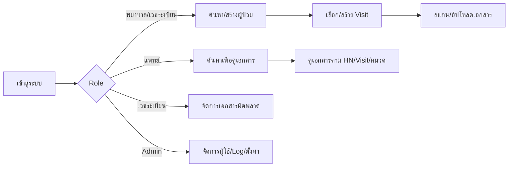
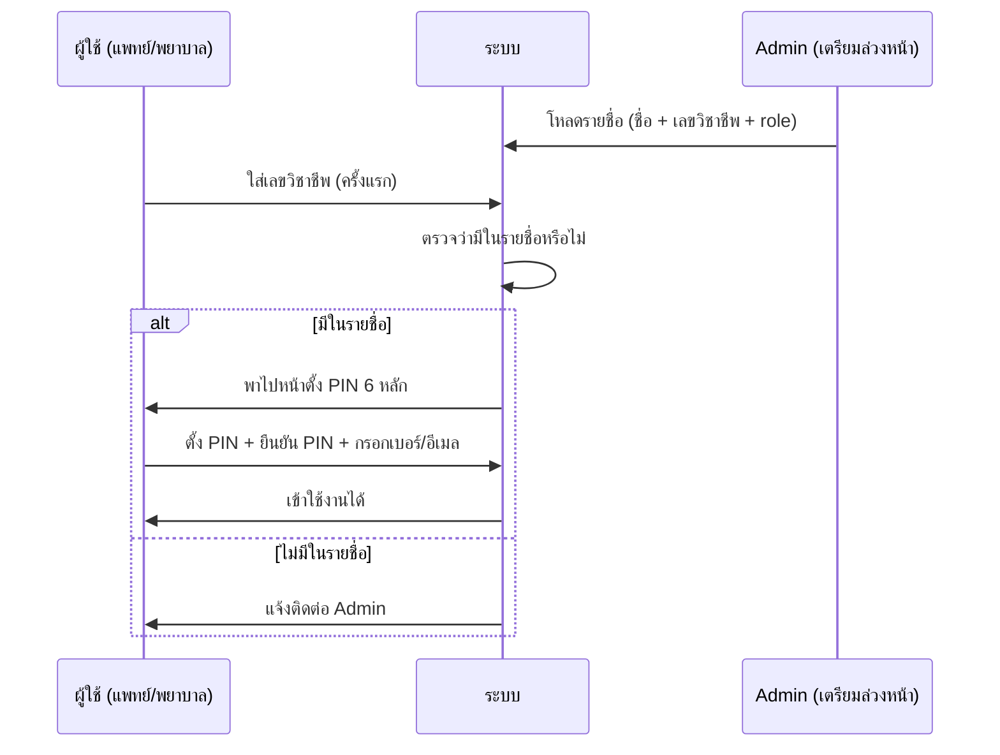
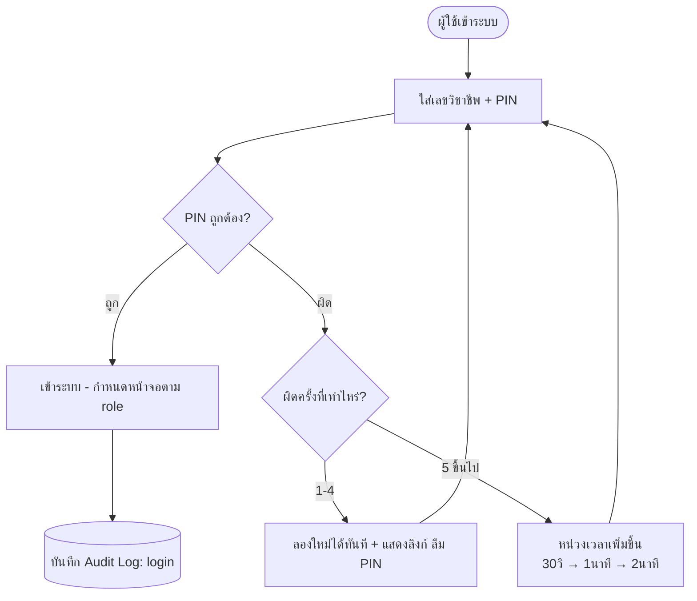
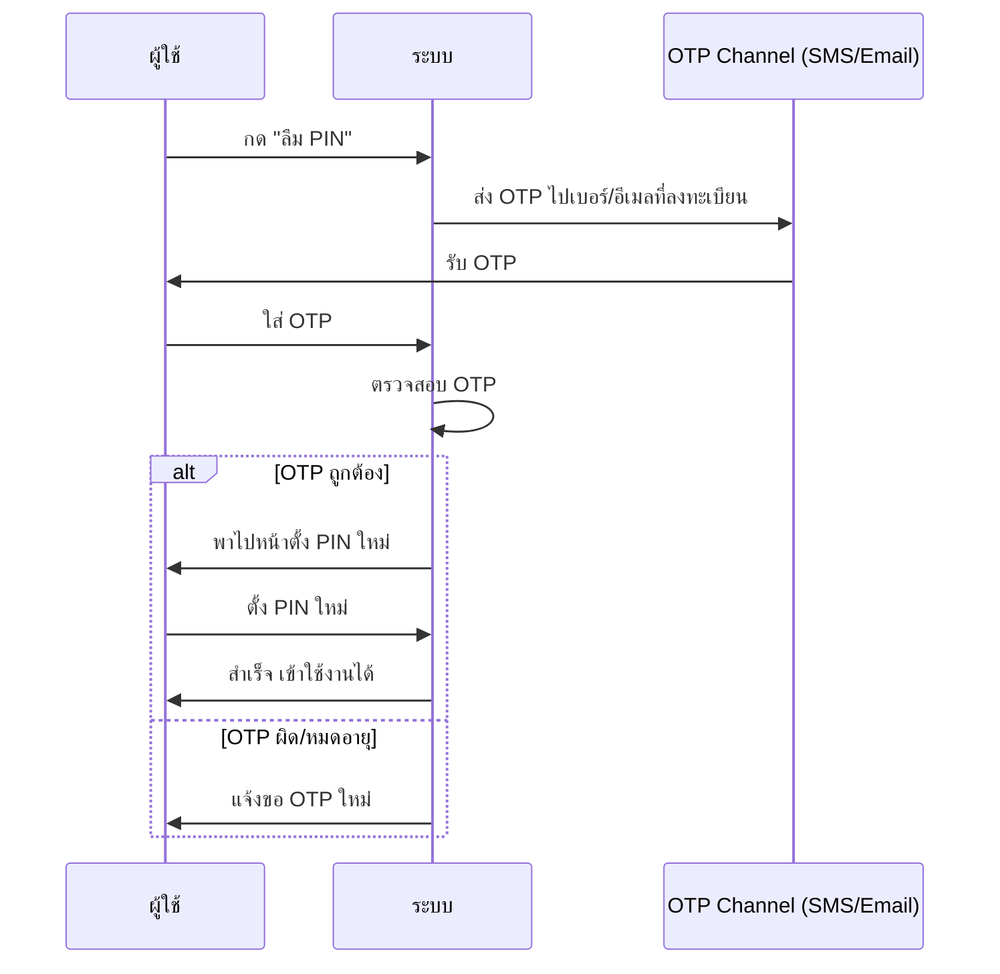
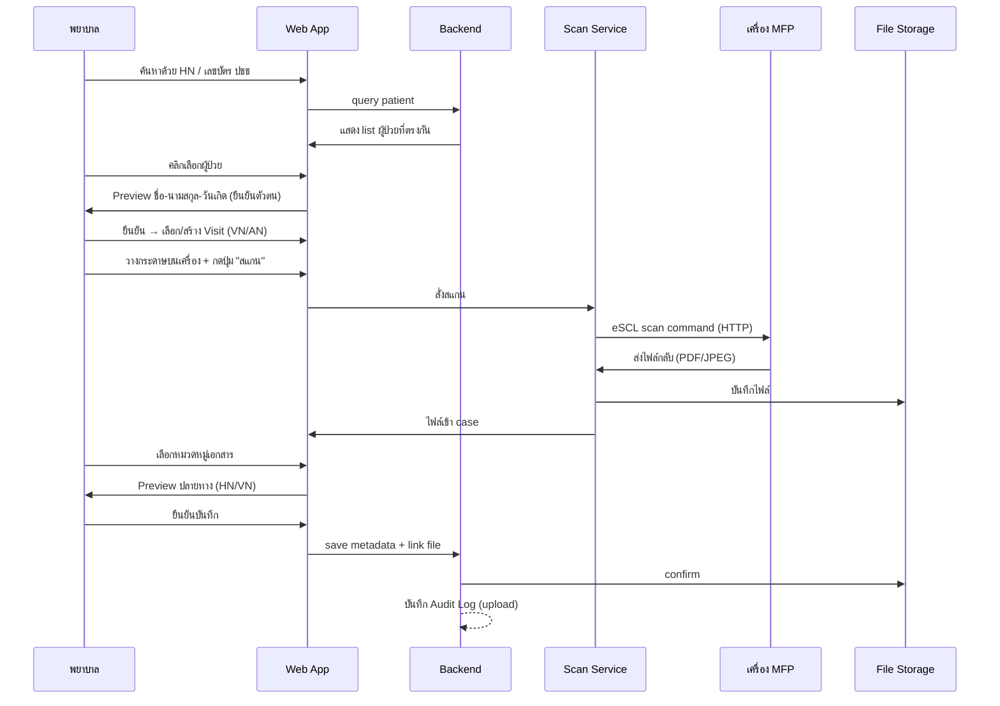
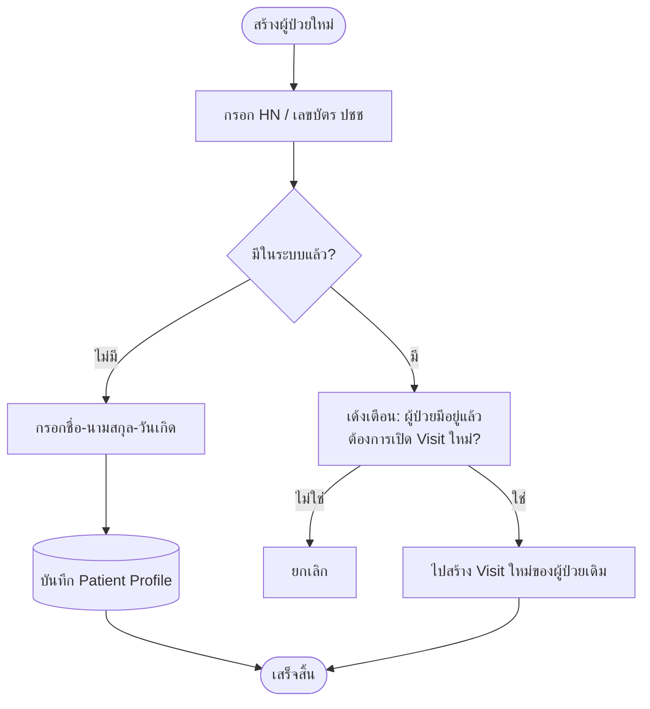
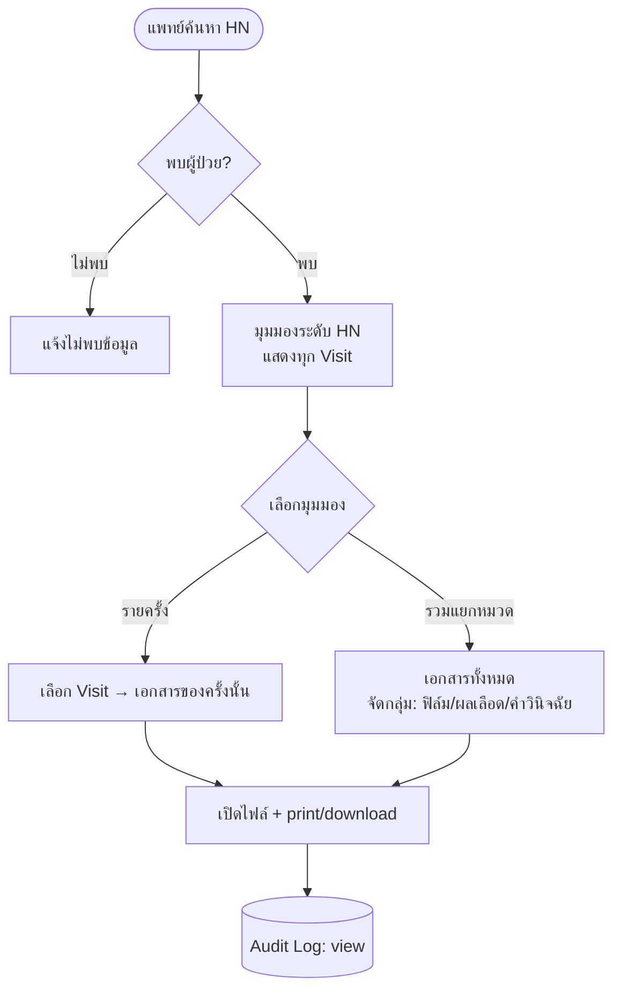
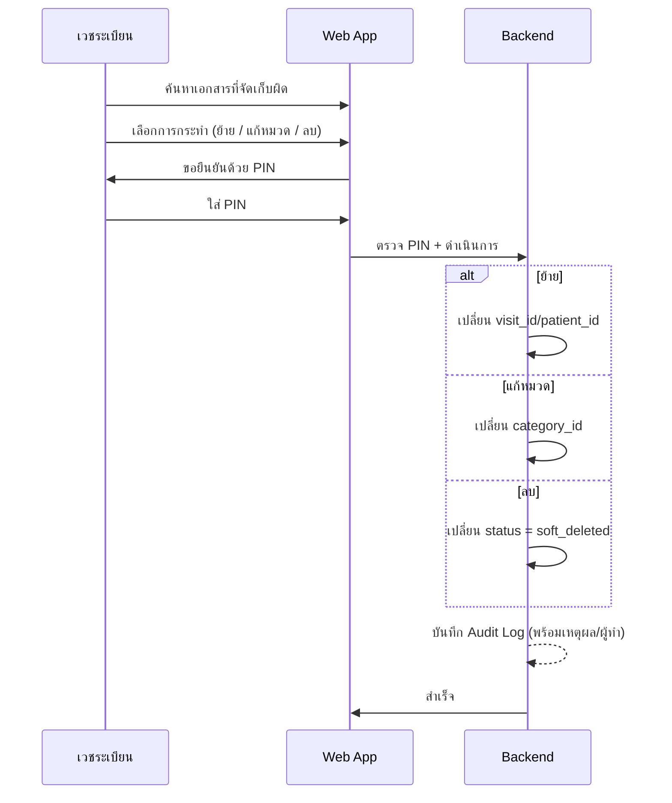

# 03 — System Flow
## ระบบจัดเก็บและเรียกดูเอกสารสแกนผู้ป่วย (EMR Scan Viewer)

> เอกสารนี้แสดงกระบวนการทำงานของระบบในรูปแบบ flow และ sequence diagram

---

## 1. ภาพรวม Flow ทั้งหมด (High-level Map)

---

## 2. Flow การเข้าใช้งานครั้งแรก (First-time Setup)

---

## 3. Flow การเข้าสู่ระบบปกติ + Throttling

> **หลักการ:** ไม่ล็อกบัญชีถาวร — บุคลากรต้องเข้าถึงข้อมูลผู้ป่วยได้เสมอ ใช้การหน่วงเวลาแทนการล็อก

---

## 4. Flow ลืม PIN (OTP Reset)

---

## 5. Flow การสแกน/จัดเก็บเอกสาร (Core Flow)

---

## 6. Flow การสร้างผู้ป่วยใหม่ (กันสร้างซ้ำ)

---

## 7. Flow การเรียกดูเอกสาร (แพทย์)

---

## 8. Flow การจัดการเอกสารผิดพลาด (เวชระเบียน)

---

## 9. สรุปจุดควบคุมสำคัญในแต่ละ Flow (Control Points)

| Flow | จุดควบคุม |
|------|----------|
| Login | Throttling แทน lockout, ไม่ล็อกถาวร |
| สแกน/จัดเก็บ | Preview 2 จุด (ยืนยันตัวตนผู้ป่วย + ยืนยันปลายทาง) |
| สร้างผู้ป่วย | ตรวจซ้ำด้วย HN/เลขบัตร ปชช |
| จัดการเอกสาร | ยืนยัน PIN ทุกครั้ง + บันทึก log |
| ทุก Flow | บันทึก Audit Log ทุกการกระทำ |
